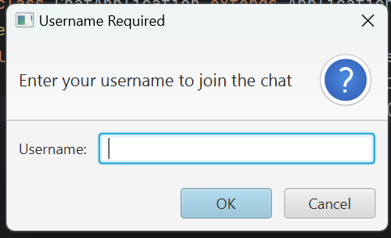
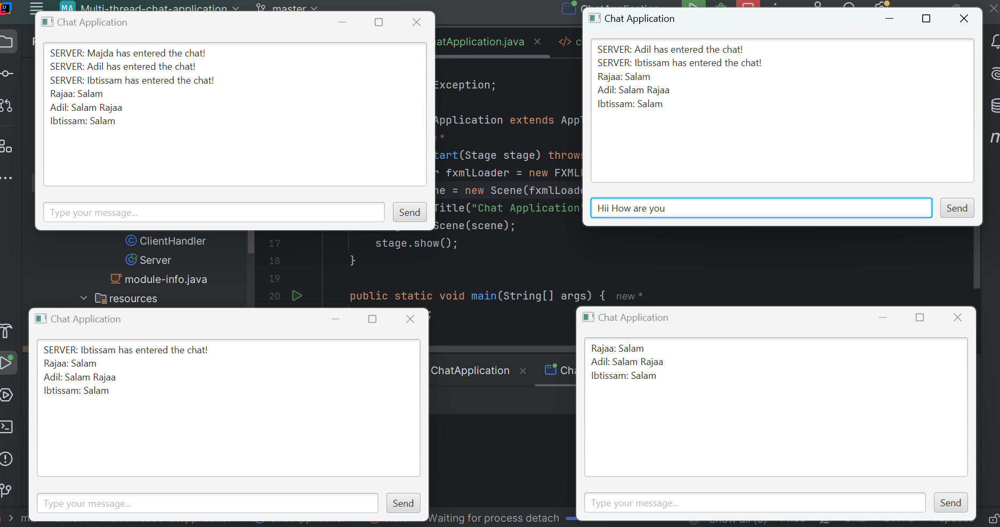
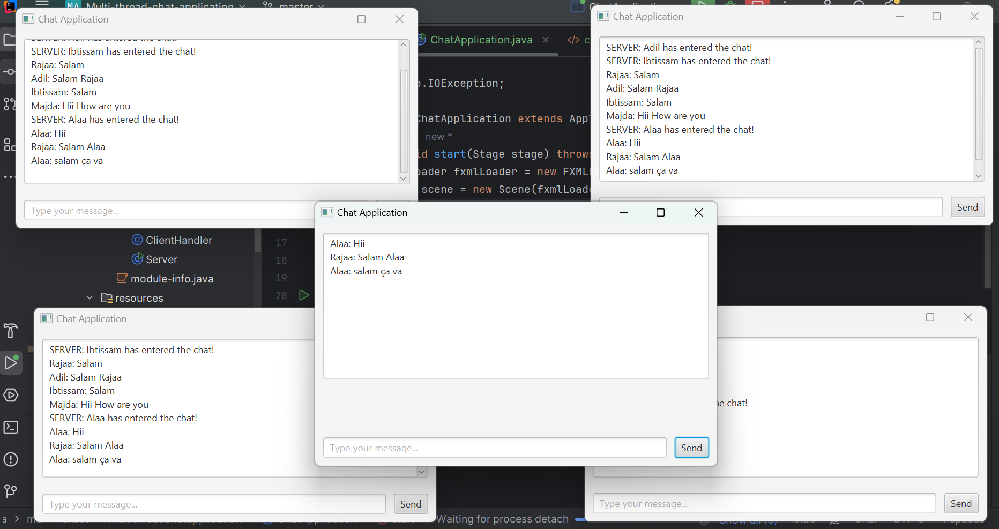
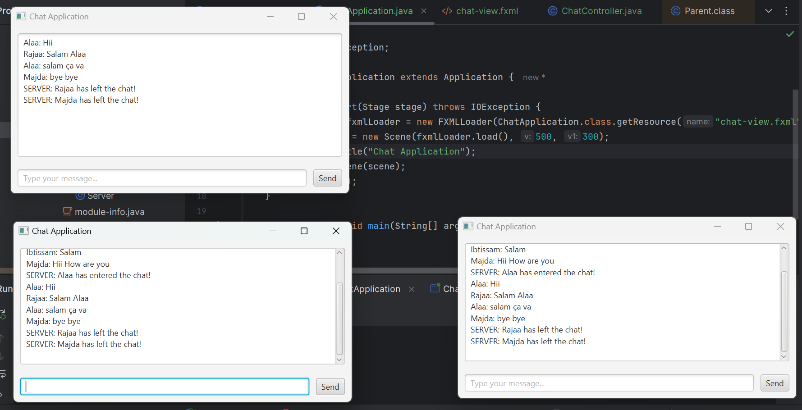

---

# Group Chat Application

This is a JavaFX-based multi-threaded chat application that allows users to communicate in real-time over a network. The application is developed as part of a **Master’s degree project** in **Computer Engineering: Big Data and Cloud Computing** at **ENSET**.

## Features

- **Multi-User Support:** Multiple clients can join the chat simultaneously.
- **User Authentication:** Users must enter a username before joining.
- **Real-Time Messaging:** Messages are instantly broadcasted to all connected users.
- **Server-Client Architecture:** Uses a central server to manage communication.
- **User Join/Leave Notifications:**
    - When a user **joins**, the message appears in **green**.
    - When a user **leaves**, the message appears in **red**.
- **Error Handling:** Alerts for connection issues or message failures.

---

## Project Structure

```
📦 Multi-thread-chat-application
 ┣ 📂 src/main/java/ma/enset/multithreadchatapplication
 ┃ ┣ 📄 Server.java        # Handles multiple clients
 ┃ ┣ 📄 Client.java        # Connects users to the server
 ┃ ┣ 📄 ClientHandler.java # Manages individual client connections
 ┃ ┣ 📄 ChatController.java # JavaFX UI logic
 ┃ ┣ 📄 ChatApplication.java # Main JavaFX application entry
 ┣ 📂 src/main/resources/ma/enset/multithreadchatapplication/
 ┃ ┣ 📄 chat-view.fxml    # JavaFX UI layout
 ┣ 📄 pom.xml             # Maven dependencies
 ┣ 📄 README.md           # Documentation
```

---

## Installation & Setup

### **Prerequisites**
- Java JDK 11+
- JavaFX 17+
- Maven

### **Run the Server**
```sh
cd Multi-thread-chat-application
mvn compile
java -cp target/classes ma.enset.multithreadchatapplication.Server
```

### **Run a Client**
```sh
java -cp target/classes ma.enset.multithreadchatapplication.ChatApplication
```

---

## Usage

1. **Start the Server**: Run the `Server` class.
2. **Start a Client**: Run `ChatApplication.java` for each user.
3. **Enter Username**: Upon launching, enter a username.
4. **Chat**: Send and receive messages in real-time.
5. **Exit**: Closing the application will notify others that the user has left.

---

## Technologies Used

- **Java 11+** – Core programming language
- **JavaFX 17+** – GUI framework
- **Maven** – Dependency management
- **Sockets (TCP/IP)** – Network communication

---
## Screenshots

## 1. Login Screen

## 2. Chat Window

## 3. User Join Notification

## 4. User Leave Notification
